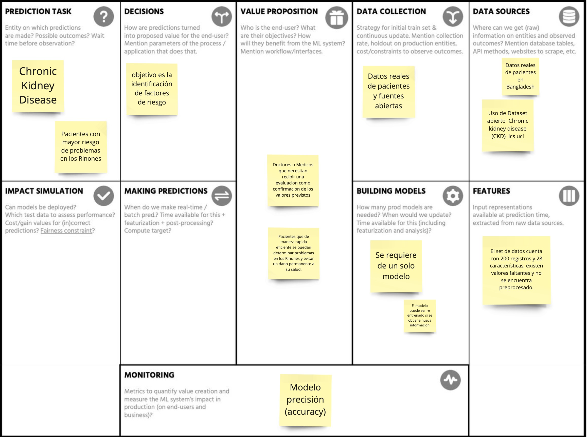
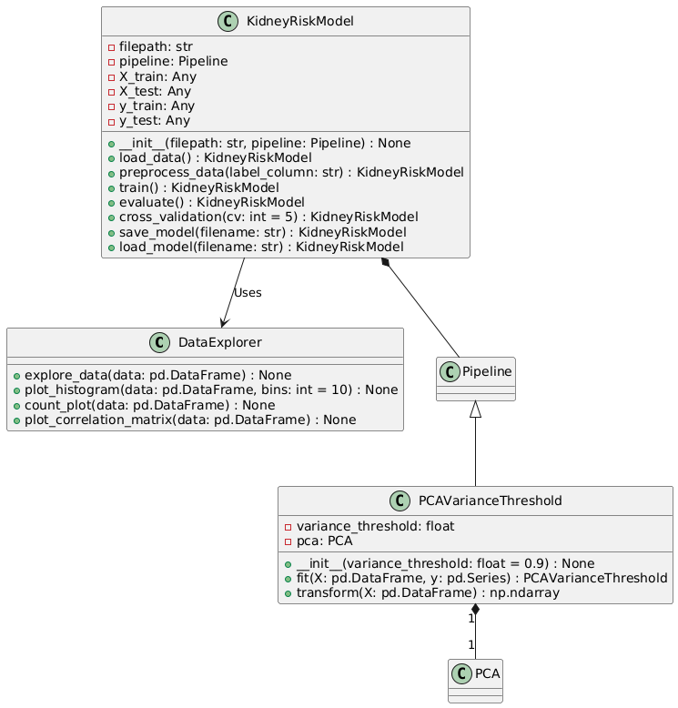

# MLOps 

Este proyecto engloba Modelo predictivo para reconocer y predecir la enfermedad renal (Chronic kidney disease). 

Elaborado por : 

- Christopher Adolfo Orduña De León A01795372
- Javier Munoz Barrios A01794423
- Mardonio Manuel Román Ramírez A01795265
- Ana Rosa Merinos Rivera A01410541
- Esteban Guerrero Rivero A01795053

# Dataset  
- Chronic kidney disease
[Dataset CKD](https://archive.ics.uci.edu/dataset/857/risk+factor+prediction+of+chronic+kidney+disease)

# ML Canvas

# UML

# RUN PROJECT

mlflow ui --default-artifact-root file://$(pwd)/mlruns

dvc repro 

# RUN API 
local:
pip install fastapi uvicorn scikit-learn pydantic
uvicorn api:app --host 0.0.0.0 --port 8000

Docker:
docker build -t kidney-api .    
docker run -p 8000:8000 kidney-api 

# TEST CURL 
### positive
curl --location --request POST 'http://localhost:8000/predict' \
--header 'Content-Type: application/json' \
--data-raw '{
  "features":[13,1.2668196606692421,0.8819171036881969,1.573411947923413,-1.366927825485268,0.5807971670914013,-0.3779644730092272,-1.6987528511321195,-0.5291502622129182,-0.3886889973882043,-0.2581988897471611,0.27012135159651346,0.7206828831786901,-0.4090748243637088,0.47205912562934776,0.07930515857181414,-0.4817338586278976,0.07730362654823517,-0.08556076330124147,0.31592330347982495,1.2408394495995603,1.3627702877384937,-0.3779644730092272,-0.48038446141526137,-0.4605661864718383,-0.42008402520840293,0.21970089915972074,0.06614178227365132,0.7540739028638986,0.9249434045663564]
}'